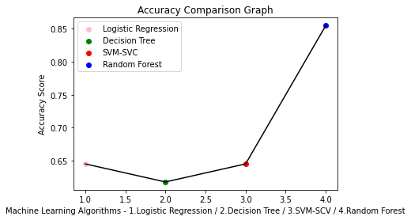

<h1Supervised Machine Learning Algorithms for Predicting Student Dropout and Academic Success: A Comparative Study</h1>

> Purpose:  We used a dataset from a higher education institution to compare various machine learning algorithms for predicting student dropout and academic success. Our focus was on algorithms that can handle imbalanced data effectively.
Design/Methodology/Approach:  To address class imbalance in the dataset, we use the SMOTE resampling method. We apply Decision Tree (DT), Support Vector Machine (SVM), and Random Forest (RF) as well as boosting algorithms like Gradient Boosting (GB), Extreme Gradient Boosting (XGBoost), CatBoost (CB), and Light Gradient Boosting Machine (LB). We apply hyperparameter tuning using Optuna to further optimize the performance of all supervised algorithms. Finally, we apply Isolation Forest (IF) outliers or anomalies in the dataset. 
Findings: Boosting algorithms outperformed traditional classification algorithms. LightGBM (LB) performed the best, achieving an F1 score of 88%. However, unsupervised anomaly detection using Isolation Forests did not perform well in identifying outliers from the minority class.
Research limitations/implications: Our study is limited to a single dataset, and its generalizability to other settings may be limited. 
Practical implications: The practical implication of this study is that it provides insights into the effectiveness of different machine learning algorithms for predicting student dropout and academic success. 
Originality/value: This project contributes to the field by benchmarking the performance of various algorithms for predicting student dropout and academic success, which can guide researchers and practitioners in selecting appropriate approaches.

<h1>Table of Contents</h1>

 

 
<!-- /TOC -->

## 1. Overview 

The purpose of this project is to create and compare different ML models to predict students admission to graduate school. As a starting point, I used a tutorial from [UCLA](http://stats.idre.ucla.edu/r/dae/logit-regression/). This tutorial applies Logistic Regression with R, but I did it with Python. After predicting students admission with Logistic Regression, I decided to fix the unequal class distribution of the original dataset.  

This imbalancement was not handled in the tutorial, so it was such a great opportunity for me to fix the imbalanced dataset. After the resampling process, I used the Logistic Regression again with the new dataset. To take the project further, I not only used Logistic Regression, but implemented other three algorithms (Decision Tree, SVM-SVC and Random Forest), along with the performance measurement and K-fold for all of the models. In conclusion, I created a graphic to compare the accuracies score for the different ML algorithms (Accuracy Comparison Graph).

## 1.1. Quick Start  
[Check out](https://nbviewer.jupyter.org/github/alicevillar/student_admission_prediction/blob/main/predicting_students_admission.ipynb) a static version of the notebook with Jupyter NBViewer from the comfort of your web browser.
 
## 2. Problem Statement

A researcher is interested in how variables, such as GRE (Graduate Record Exam scores), GPA (grade point average) and prestige of the undergraduate institution,
effect admission into graduate school. The response variable, admit/don’t admit, is a binary variable.This data set has a binary response (outcome, dependent) variable called admit, which is equal to 1 if the individual was admitted to graduate school, and 0 otherwise. There are three predictor variables: gre, gpa, and rank. We will treat the variables gre and gpa as continuous. The variable rank takes on the values 1 through 4. Institutions with a rank of 1 have the highest prestige, while those with a rank of 4 have the lowest. [Source : UCLA](http://stats.idre.ucla.edu/r/dae/logit-regression/)

## 2.1. Dataset  

[Check out](https://github.com/alicevillar/student_admission_prediction/blob/main/dataset_admissions.csv) the dataset

## 3. Approach 

This project is organized in two Chapters. In Chapter 1 I worked with the original dataset (which was imbalanced). In Chapter 2 I did a resampling (oversampling), repeated the logistic regression and included other algarithms. 

## 3.1. Chapter 1 - Predicting students admission with Logistic Regression 

* PART 1: Data Handling -> Importing Data with Pandas, Cleaning Data, Data description.
* PART 2: Data Analysis -> Supervised ML Technique:Logistic Regression.
* PART 3: Valuation of the Analysis -> Performance measurement + K-folds cross validation to evaluate results locally.

## 3.2 Chapter 2 - Predicting students admission with Logistic Regression, Decision Tree, SVM (SVC) and Random Forest

* PART 1: Data Handling -> Importing Data with Pandas, Cleaning Data, Data description.
* PART 2: Data Analysis -> Supervised ML Technique: Logistic Regression, Decision Tree, SVM (SVC) and Random Forest
* PART 3: Valuation of the Analysis -> Performance measurement + K-folds cross validation to evaluate results locally + Accuracy comparison graph
 
## 4. Dependencies 
 
* [Numpy](https://numpy.org/)
* [Pandas](https://pandas.pydata.org/)
* [SciKit-Learn](https://scikit-learn.org/)
* [Matplotlib](https://matplotlib.org/)
* [Seaborn](https://seaborn.pydata.org/)
 
## 5. Results

In this project I have applied a widely adopted technique for dealing with unbalanced datasets called resampling. Random Sampling involves creating a new transformed version of the data with a new class distribution. The goal is to reduce the influence of the data on our ML algorithm. Generally, oversampling is preferable as under sampling can result in the loss of important data. I chose to apply oversampling and then use four ML algorithms: Logistic Regression, Decision Tree, SVM (SVC) and Random Forest. To all these modeles I did a Valuation Analisis (Performance Measurement and K-Fold). Finally, I created a graph to compare the accuracy of the different models. I have found the best accuracy score with Random forest (0.8545454545454545).

 
